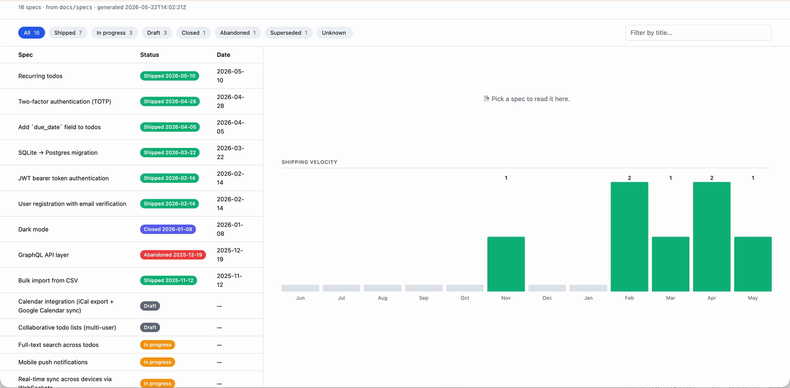

# specs-dashboard

[](LICENSE)
[](https://www.python.org)
[](https://github.com/lightfromthesky/specs-dashboard/releases)

Browse a directory of markdown spec files — as a **single-file HTML dashboard**
(open in any browser, no server) or **directly from your terminal** via CLI.

- **Filter by status** — Shipped / In progress / Draft / Closed / Abandoned / Superseded
- **Search** by title or filename (optionally body content)
- **Render markdown inline** — click in the HTML view; pipe `show` to `glow` / `bat` in the CLI

## See it in action

The dashboard in a browser — filter, search, click to read inline:



The CLI from your terminal — `counts`, `list`, `show`, `build`:


Try it yourself — a sample project lives in [`example/`](example/):

```
cd example
open specs_dashboard.html
```

The browser opens the pre-built dashboard with 16 example specs covering every status bucket. Click chips, click rows, search — works without any setup.

## Install in your project

specs-dashboard is **one Python file, zero dependencies**. The intended install model is to **vendor it directly into your repo** — so your team and CI use the same pinned version without each running their own install.

```bash
mkdir -p tools/specs-dashboard
curl -L https://raw.githubusercontent.com/lightfromthesky/specs-dashboard/v1.0.0/specs_dashboard.py \
  -o tools/specs-dashboard/specs.py
```

> **Want a flatter layout?** Skip the subfolder — `curl … -o tools/specs.py` and invoke with `python3 tools/specs.py build`. Substitute the path everywhere else in this README.

Then expose it via whatever script runner your project already uses.

**Makefile** (works for any project — Python, Java, Go, Rust, etc.):
```Makefile
specs:
	@python3 tools/specs-dashboard/specs.py build && open specs_dashboard.html
```

**Node / JavaScript** (`package.json`):
```json
{
  "scripts": {
    "specs": "python3 tools/specs-dashboard/specs.py build && open specs_dashboard.html"
  }
}
```

**Gradle**:
```groovy
task specs(type: Exec) {
  commandLine 'python3', 'tools/specs-dashboard/specs.py', 'build'
}
```

Then `make specs` / `npm run specs` / `./gradlew specs` generates a fresh dashboard. Your repo's language doesn't matter — the tool just reads markdown.

### Why vendor instead of `pip install`?

- **Pinned by file content.** The version is literally what's in the repo — no lockfile drift, no transitive-dep surprises.
- **No teammate install step.** Everyone gets the same version on `git pull`.
- **Works in CI with no setup.** Just `python3 tools/specs-dashboard/specs.py build`.
- **Language-agnostic.** Your project being Java/Go/Rust doesn't matter.
- **Tiny.** 30 KB single file, zero transitive deps.

### Upgrading

Re-run the curl with the new tag:

```bash
curl -L https://raw.githubusercontent.com/lightfromthesky/specs-dashboard/v1.1.0/specs_dashboard.py \
  -o tools/specs-dashboard/specs.py
```

The diff shows exactly what changed — no surprise upgrades.

### Personal-use install

If you just want `specs` as a global command on your machine:

```bash
git clone https://github.com/lightfromthesky/specs-dashboard.git
echo "alias specs='python3 $(pwd)/specs-dashboard/specs_dashboard.py'" >> ~/.zshrc
```

Now `specs build` works in any directory with a `docs/specs/` or `specs/` folder.

## Setup with Claude Code, Cursor, or other AI agents

If you use an AI coding agent in your repo, hand it this prompt:

```
Set up specs-dashboard in this repo from
https://github.com/lightfromthesky/specs-dashboard.
Follow the "Agent install protocol" section of the README.
```

Or paste the explicit version directly:

```
Set up specs-dashboard in this repo:

1. Vendor specs_dashboard.py to tools/specs-dashboard/specs.py:
   curl -fsSL https://raw.githubusercontent.com/lightfromthesky/specs-dashboard/v1.0.0/specs_dashboard.py -o tools/specs-dashboard/specs.py

2. Detect this project's script runner (Makefile / package.json /
   build.gradle / justfile) and add a 'specs' target/task that runs
   `python3 tools/specs-dashboard/specs.py build`.

3. Add specs_dashboard.html to .gitignore.

4. If neither docs/specs/ nor specs/ exists, create docs/specs/ and add
   a starter spec with a "**Status:** Draft" line below the title.

5. Run the integration (make specs / npm run specs / etc.) and verify
   specs_dashboard.html is generated.
```

Confirmed compatible with: Claude Code, Cursor, Aider, Continue, Cline.

## Agent install protocol

When an AI agent is asked to set up specs-dashboard in a user's repo, follow these steps deterministically.

### 1. Vendor the script

```bash
mkdir -p tools/specs-dashboard
curl -fsSL https://raw.githubusercontent.com/lightfromthesky/specs-dashboard/v1.0.0/specs_dashboard.py \
  -o tools/specs-dashboard/specs.py
```

Commit `tools/specs-dashboard/specs.py`.

### 2. Detect the script runner and integrate

| If the repo has | Add this integration |
|---|---|
| `Makefile` | A `specs:` target running `python3 tools/specs-dashboard/specs.py build` |
| `package.json` | `"specs": "python3 tools/specs-dashboard/specs.py build"` in the `scripts` block |
| `build.gradle` / `build.gradle.kts` | A `specs` task: `commandLine 'python3', 'tools/specs-dashboard/specs.py', 'build'` |
| `justfile` | A `specs:` recipe running `python3 tools/specs-dashboard/specs.py build` |
| None of the above | Create a `Makefile` with the snippet above |

### 3. Add `specs_dashboard.html` to `.gitignore`

The generated HTML is a build artifact — do not commit it.

### 4. Create the specs directory if missing

If neither `docs/specs/` nor `specs/` exists, create `docs/specs/` and add a starter spec following the convention in "Spec content convention" below.

### 5. Verify

Run the integration (`make specs` / `npm run specs` / `./gradlew specs`) and confirm `specs_dashboard.html` is generated.

### Don't

- Don't add specs-dashboard as a `pip install` / `package.json` dependency — vendor it.
- Don't commit the generated `specs_dashboard.html`.
- Don't invent custom status values — use the canonical six from the convention section.

## Spec-driven development for AI-agent-friendly codebases

In 2026, AI coding agents (Claude Code, Cursor, Aider, others) work dramatically better when they can read **specs as ground truth** before touching code. Teams that previously worked code-first are increasingly writing spec-first — the agent then builds to the spec, and the spec stays as durable design history.

The gap: **every codebase puts specs in a different place.** Agents either ask, scan, or guess. Without a discoverable convention, the productivity win evaporates on every new codebase.

specs-dashboard's recommendation:

```
your-project/
├── docs/
│   └── specs/        ← put your specs here
│       ├── feature-foo.md
│       └── refactor-bar.md
└── ...
```

Why `docs/specs/`:

- **Recognizable** — specs are documentation; they belong under the canonical docs tree
- **Greppable** — agents searching for `docs/specs/` find them in one shot
- **Already common** — the closest thing to a default in mid-size codebases today

If you have very few specs and prefer eye-level visibility for agents, **`specs/` at the repo root** also works — the tool autodetects both:

```
python3 specs_dashboard.py counts   # finds docs/specs/ or specs/ automatically
```

For any other location (ADRs in `docs/adr/`, RFCs in `rfcs/`, proposals in `docs/proposals/`), use `--input PATH` — the tool is opinionated about the *content shape* (an H1 title + a `**Status:**` line at the top), not the *folder path*.

## Spec content convention

Every spec must have an H1 title and a `**Status:**` line within the first 30 lines:

```md
# My feature spec

**Status:** Shipped 2026-01-15

## Problem
…
```

Canonical status values:

| Value | Bucket |
|---|---|
| `Shipped 2026-01-15` | Shipped (with date) |
| `In progress` | In progress |
| `Draft` | Draft |
| `Closed 2026-01-15` | Closed (with date — shipped then reverted, or completed-and-archived) |
| `Abandoned 2026-01-15` | Abandoned (with date) |
| `Superseded by docs/specs/new-spec.md` | Superseded |

Legacy values are tolerated by default and mapped to canonical buckets:

| Legacy | Mapped to |
|---|---|
| `Completed`, `Live`, `Implemented` | Shipped |
| `Pending`, `Planned` | Draft |

Pass `--no-legacy-aliases` to disable.

## Usage

### Generate the HTML dashboard

```
python3 specs_dashboard.py build
```

Looks for `docs/specs/` then `specs/`, walking up parent directories from the current working directory until it finds one or hits a `.git` boundary. So running from a subfolder (e.g. `tools/specs-dashboard/`) still finds the specs at the repo root. Output goes to `specs_dashboard.html` in the current directory by default.

Explicit paths and titles:

```
python3 specs_dashboard.py build --input ./docs/specs --output ./specs_dashboard.html --title "My project specs" --exclude SPEC_TEMPLATE.md
```

Open the result:

```
open specs_dashboard.html
```

### Terminal CLI

List specs, filtered by status, sorted by bucket + date:

```
python3 specs_dashboard.py list
python3 specs_dashboard.py list --status shipped
python3 specs_dashboard.py list --status "in progress"
```

Status breakdown:

```
python3 specs_dashboard.py counts
```

Search titles + filenames; add `--body` to also search content:

```
python3 specs_dashboard.py search realtime
python3 specs_dashboard.py search "due date" --body
```

Render a spec to stdout (pipe through `glow` / `bat -l md` / `mdcat` for nice terminal rendering):

```
python3 specs_dashboard.py show realtime-sync
python3 specs_dashboard.py show realtime-sync | glow -
```

Machine-readable JSON:

```
python3 specs_dashboard.py list --json | jq '.[] | select(.bucket=="Draft")'
python3 specs_dashboard.py counts --json
```

### All flags

| Flag | Subcommands | Purpose |
|---|---|---|
| `--input PATH` | all | Spec directory (autodetected from `docs/specs/` then `specs/`) |
| `--exclude FILENAME` | all | Skip this filename (repeatable) |
| `--no-legacy-aliases` | all | Treat `Completed`/`Live`/`Pending` as Unknown |
| `--output PATH` | `build` | HTML output path (default: `specs_dashboard.html`) |
| `--title TEXT` | `build` | Page title |
| `--status BUCKET` | `list` | Filter to one bucket (case-insensitive) |
| `--body` | `search` | Also match against spec body |
| `--quiet`, `-q` | `list`, `search` | One filename per line, no other output |
| `--json` | `list`, `counts` | JSON output |

## Auto-refresh after spec edits

Wire `build` into a git pre-commit hook or CI step:

```
# .git/hooks/pre-commit
python3 specs_dashboard.py build
git add specs_dashboard.html
```

```yaml
# .github/workflows/specs-dashboard.yml
- run: python3 specs_dashboard.py build
- run: git diff --exit-code specs_dashboard.html   # fails if stale
```

## Implementation notes

- **Self-contained HTML.** Spec bodies are embedded as JSON in a `<script type="application/json">` block. Every `<` is escaped to `<` so the HTML parser never sees a `</script>` or `<!--` inside the data; `JSON.parse` decodes back to `<`.
- **Markdown rendering is lazy.** `marked.parse()` only runs when you click a spec row.
- **No build step.** One Python file, one CDN dependency (marked.js for HTML mode). Drop it into any project.

## License

MIT — see [LICENSE](LICENSE).
